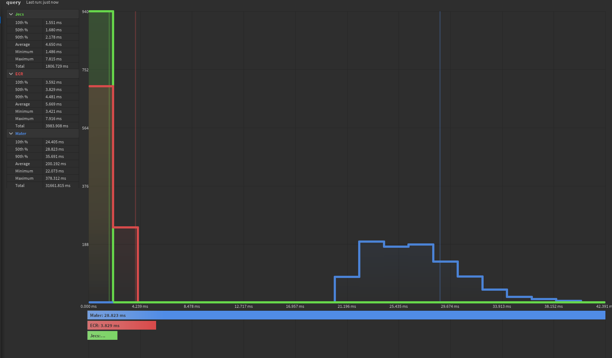
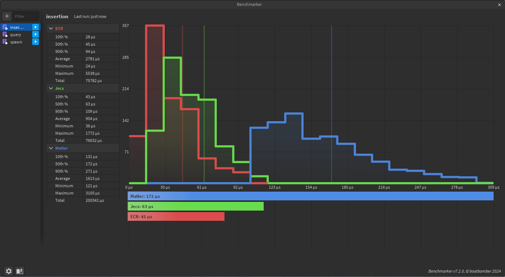

<p align="center">
  
  
</p>

[](LICENSE-APACHE)
[](https://wally.run/package/ukendio/jecs)

Just an ECS

jecs is a stupidly fast Entity Component System (ECS).

- Entity Relationships as first class citizens
- Iterate 500,000 entities at 60 frames per second
- Type-safe [Luau](https://luau-lang.org/) API
- Zero-dependency package
- Optimized for column-major operations
- Cache friendly archetype/SoA storage
- Unit tested for stability

### Example

```lua
local world = jecs.World.new()
local pair = jecs.pair

local ChildOf = world:component()
local Name = world:component()

local function parent(entity)
    return world:target(entity, ChildOf)
end
local function getName(entity)
    return world:get(entity, Name)
end

local alice = world:entity()
world:set(alice, Name, "alice")

local bob = world:entity()
world:add(bob, pair(ChildOf, alice))
world:set(bob, Name, "bob")

local sara = world:entity()
world:add(sara, pair(ChildOf, alice))
world:set(sara, Name, "sara")

print(getName(parent(sara)))

for e in world:query(pair(ChildOf, alice)) do
    print(getName(e), "is the child of alice")
end

-- Output
-- "alice"
-- bob is the child of alice
-- sara is the child of alice
```

21,000 entities 125 archetypes 4 random components queried.

Can be found under /benches/visual/query.luau

Inserting 8 components to an entity and updating them over 50 times.

Can be found under /benches/visual/insertions.luau
