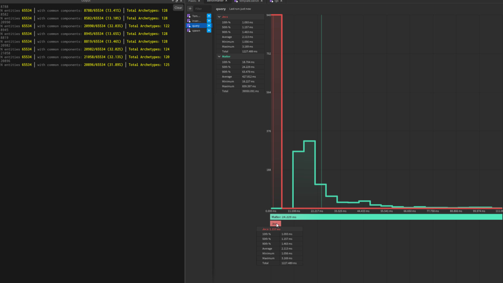

[](LICENSE-APACHE)
[](https://wally.run/package/ukendio/jecs)

Just an ECS

jecs is a stupidly fast Entity Component System (ECS). 

- Process tens of thousands of entities with ease every frame
- Zero-dependency Luau package
- Optimized for column-major operations
- Cache friendly archetype/SoA storage 

### Example

```lua
local world = Jecs.World.new()

local player = world:entity() 
local opponent = world:entity()

-- Notice how components are just entities
local Health = world:entity() 
local Damage = world:entity()
local Position = world:entity()

world:add(player, Health, 100)
world:add(player, Damage, 8)
world:add(player, Position, Vector3.new(0, 5, 0))

world:add(opponent, Health, 100)
world:add(opponent, Damage, 21)
world:add(opponent, Position, Vector3.new(0, 5, 3))

for playerId, playerPosition, health in world:query(Position, Health) do 
    local totalDamage = 0
    for _, opponentPosition, damage in world:query(Position, Damage) do 
        if (playerPosition - opponentPosition).Magnitude < 5  then 
            totalDamage += damage
        end
    end

    world:add(playerId, Health, health - totalDamage)  
end

assert(world:get(playerId, Health) == 79)
assert(world:get(opponentId, Health) == 92)

```


