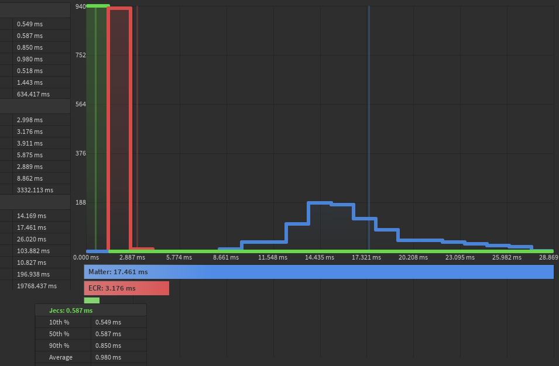

<p align="center">
  
  
</p>

[](LICENSE-APACHE)
[](https://wally.run/package/ukendio/jecs)

Just an ECS

jecs is a stupidly fast Entity Component System (ECS).

- Process tens of thousands of entities with ease every frame
- Zero-dependency Luau package
- Optimized for column-major operations
- Cache friendly archetype/SoA storage
- Entity Relationships as first class citizens

### Example

```lua
local world = World.new()

local player = world:entity()
local opponent = world:entity()

local Health = world:component()
local Position = world:component()
-- Notice how components can just be entities as well?
-- It allows you to model relationships easily!
local Damage = world:entity()
local DamagedBy = world:entity()

world:set(player, Health, 100)
world:set(player, Damage, 8)
world:set(player, Position, Vector3.new(0, 5, 0))

world:set(opponent, Health, 100)
world:set(opponent, Damage, 21)
world:set(opponent, Position, Vector3.new(0, 5, 3))

for playerId, playerPosition, health in world:query(Position, Health) do
    local totalDamage = 0
    for opponentId, opponentPosition, damage in world:query(Position, Damage) do
        if (playerPosition - opponentPosition).Magnitude < 5 then
            totalDamage += damage
        end
        world:set(playerId, ECS_PAIR(DamagedBy, opponentId), totalDamage)
    end
end

-- Gets the damage inflicted by our specific opponent!
for playerId, health, inflicted in world:query(Health, ECS_PAIR(DamagedBy, opponent)) do 
    world:set(playerId, health - inflicted)
end

assert(world:get(playerId, Health) == 79)
```

125 archetypes, 4 random components queried.

Can be found under /benches/query.lua

Inserting 8 components to an entity and updating them over 50 times.

Can be found under /benches/insertions.lua
