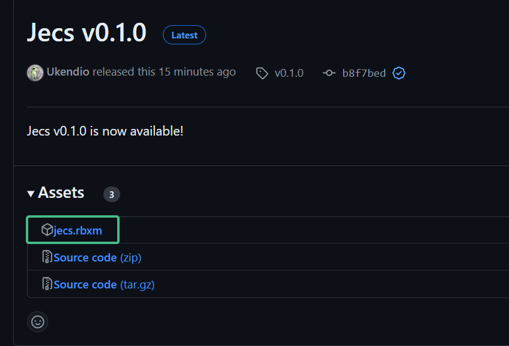

# Getting Started

## Installation

### Installing Standalone

Navigate to the [releases page](https://github.com/Ukendio/jecs/releases) and download `jecs.rbxm` from the assets.



### Using Wally

Add the following to your wally configuration:

::: code-group

```toml [wally.toml]
jecs = "ukendio/jecs@0.5.3"
```

:::

### Using npm (roblox-ts)

Use one of the following commands on your root project directory:

::: code-group
```bash [npm]
npm i https://github.com/Ukendio/jecs.git
```
```bash [yarn]
yarn add https://github.com/Ukendio/jecs.git
```
```bash [pnpm]
pnpm add https://github.com/Ukendio/jecs.git
```

:::

## Example Usage

::: code-group

```luau [Luau]
local world = jecs.World.new()
local pair = jecs.pair
local Wildcard = jecs.Wildcard

local Name = world:component()

local function getName(e)
    return world:get(e, Name)
end

local Eats = world:component()

-- Relationship objects
local Apples = world:component()
-- components are entities, so you can add components to components
world:set(Apples, Name, "apples")
local Oranges = world:component()
world:set(Oranges, Name, "oranges")

local bob = world:entity()
-- Pairs can be constructed from two entities

world:set(bob, pair(Eats, Apples), 10)
world:set(bob, pair(Eats, Oranges), 5)
world:set(bob, Name, "bob")

local alice = world:entity()
world:set(alice, pair(Eats, Apples), 4)
world:set(alice, Name, "alice")

for id, amount in world:query(pair(Eats, Wildcard)) do
    -- get the second target of the pair
    local food = world:target(id, Eats)
    print(string.format("%s eats %d %s", getName(id), amount, getName(food)))
end

-- Output:
--   bob eats 10 apples
--   bob eats 5 pears
--   alice eats 4 apples  
```


```ts [Typescript]
import { Wildcard, pair, World } from "@rbxts/jecs"


const world = new World()
const Name = world.component()
function getName(e) {
  return world.get(e, Name)
}

const Eats = world.component()

// Relationship objects
const Apples = world.component()
// components are entities, so you can add components to components
world.set(Apples, Name, "apples")
const Oranges = world.component()
world.set(Oranges, Name, "oranges")

const bob = world.entity()
// Pairs can be constructed from two entities

world.set(bob, pair(Eats, Apples), 10)
world.set(bob, pair(Eats, Oranges), 5)
world.set(bob, Name, "bob")

const alice = world.entity()
world.set(alice, pair(Eats, Apples), 4)
world.set(alice, Name, "alice")

for (const [id, amount] of world.query(pair(Eats, Wildcard))) {
  // get the second target of the pair
  const food = world:target(id, Eats)
  print(string.format("%s eats %d %s", getName(id), amount, getName(food)))
}

// Output:
//   bob eats 10 apples
//   bob eats 5 pears
//   alice eats 4 apples   

```

