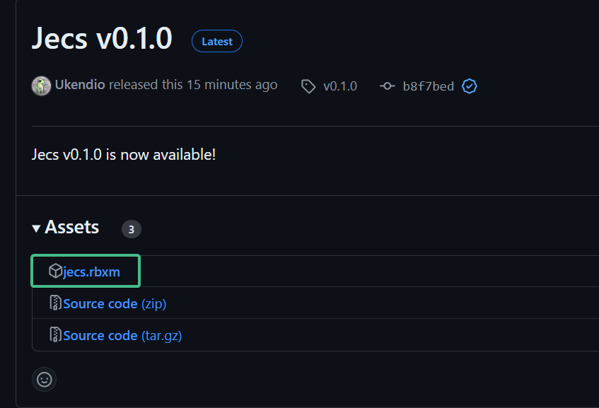

# Getting Started 
This section will provide a walk through setting up your development environment and a quick overview of the different features and concepts in Jecs with short examples.

## Installing Jecs

To use Jecs, you will need to add the library to your project's source folder.

## Installing as standalone
Head over to the [Releases](https://github.com/ukendio/jecs/releases/latest) page and install the rbxm file.


## Installing with Wally
Jecs is available as a package on [wally.run](https://wally.run/package/ukendio/jecs)

Add it to your project's Wally.toml like this:
```toml
[dependencies]
jecs = "0.1.0" # Make sure this is the latest version
```